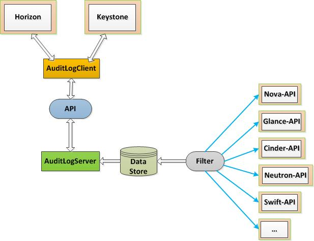

系统架构
========

操作审计作为是平行与其它模块的一个单独功能模块，该功能主要作用是收集记录用户的操作行为并提供工具方便查看。

主要组件
````````



   操作审计系统架构图

如系统架构图所示，操作审计主要由以下组件组成：

* Filter：WSGI应用中间件，用于采集各个API服务的用户操作
* AuditLogServer：提供审计日志查询接口的API服务
* AuditLogClient：文件Horizon及其它第三方工具使用API服务的SDK
* DataStore：存储操作审计日志的数据存储服务，目前仅支持mongodb

操作审计还在horizon项目增加了专门的面板，方便用户集中查询日志数据。同时，操作审计API服务与keystone认证服务集成进行用户认证。

主要流程
````````

操作审计功能主要有两个数据流程，审计日志采集、审计日志查询。

*审计日志采集* 流程收集用户发起的各种API操作请求、操作数据、处理结果等信息，并保存到存储服务。具体由以下步骤组成：

#. 用户向某个API服务发送请求
#. 审计日志中间件拦截该请求的上下文以及操作数据，并缓存
#. API服务处理用户请求并返回响应
#. 审计日志中间件拦截API服务响应的处理结果与缓存的请求信息一起保存到存储服务
#. 审计日志中间件返回响应给用户

*审计日志查询* 流程接收用户查询请求，检查用户权限并返回符合条件的审计日志。具体步骤如下：

#. 用户向操作审计API服务发送查询请求（通过客户端或者直接发送）
#. API服务检查用户认证信息、数据权限
#. API服务从数据存储查询符合用户要求和权限要求的审计日志
#. API服务返回审计日志给用户

